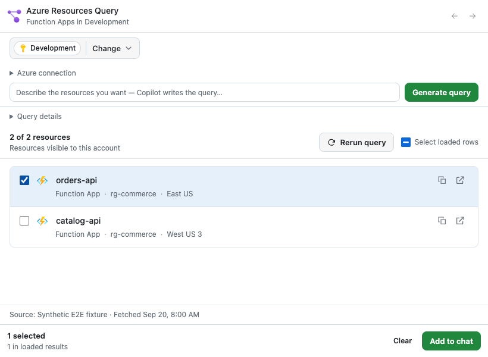

# Azure Resources Query

Find Azure resources in GitHub Copilot, inspect their details, and add a selected set to your conversation. Azure Resources Query runs read-only Azure Resource Graph (ARG) queries in the subscriptions you choose; results stay in a browsable panel instead of filling your chat with a table.

*Example panel with synthetic resources, not customer Azure data.*

The product name and Resource Graph Explorer icon stay visible as you switch
queries; the current view's title appears underneath. The panel follows your
host theme.

## Try it

Ask Copilot:

> Show my Function Apps in Development.

Then refine the same view:

> Only those in West Europe.

Or start another resource list:

> Show storage accounts in Development.

Replace **Development** with your subscription name or ID. You can also list Web Apps, VMs, or other resources supported by ARG. Copilot writes the KQL; **Query details** shows the exact query behind the displayed results.

## First run: scope, inspect, select, add to chat

1. **Confirm scope.** Ask for a list. Without a named subscription, choose
   **Continue** to confirm an eligible CLI default, or choose subscriptions in
   the panel. Nothing is preselected or silently accepted. A unique enabled
   named match can run immediately; ambiguous names require a choice.
   Confirmation runs the supplied query once. Cancel stops it.
2. **Inspect.** Click a resource name to see its query fields and read-only ARM
   details. Use **Back to results** to return. **Copy ID** and **Open in portal**
   are available per resource.
3. **Select.** Check individual resources or **Select loaded rows**. Selection
   applies to loaded rows, not every unseen result. Use **Load more** when
   available and review any incomplete-results warning.
4. **Add to chat.** Click **Add to chat** to share the selected resource context
   with Copilot. Selection is context, not permission to change those resources.

Follow-up requests keep the current scope and refine the query. **Change**
lets you choose a different scope; **Apply** runs the current query in that
scope. **Rerun query** refreshes the displayed inventory. Sign-in/profile reload
does not rerun it automatically.

## Troubleshooting

| Symptom | What to check |
| --- | --- |
| Azure CLI not found | Install Azure CLI 2.61+ and ensure `az` is on the provider's PATH, not just a terminal alias. Reload the host after correcting its environment. |
| Sign-in required or wrong account | Sign in explicitly, then **Reload CLI profile** after an external CLI change. **Refresh from Azure** is separate and can update the shared CLI profile. Neither runs KQL. |
| Permission denied | Check the account, tenant and selected subscriptions. Ask your administrator for the required read access; this canvas does not grant roles. An ARG result does not guarantee permission to read every resource's ARM details. |
| No matching subscriptions | Check the name/ID and enabled status. This is unresolved scope, not proof that there are no resources. |
| No results | Review the executed KQL, selected subscriptions and location criteria. Zero rows means no resources visible to this account matched this query; ARG can lag recent changes. |
| Panel missing or old panel reappears | Inspect the enabled provider, reload extensions once, and retry only if the canonical canvas is registered. An existing panel stays bound to its old provider; close it or use a fresh chat after correcting installation. |

## Replace or roll back

For plugins, use the host's plugin update operation; the extension, assets and
launcher skill share one version. Retain the prior approved catalog commit for
rollback. For direct extensions, close the provider and replace the **whole**
folder, not individual files; restore the previous folder to roll back.
Preserve the session's `files/azure-resource-browser` directory and saved views.

`release.json` identifies the included version; `checksums.json` detects
accidental modification, not publisher authenticity or permission to publish.
Isolated fixture install/update checks are not desktop-app auto-update,
real-Azure, or public-release certification.
